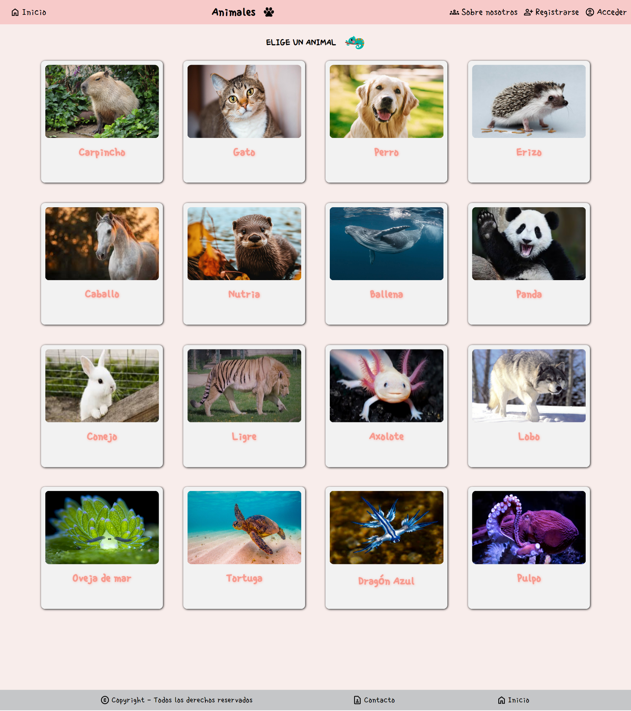
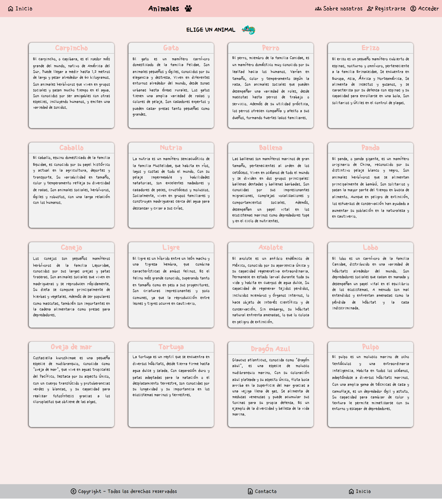

<h1 align='center'>🌟 Página sobre animales 🐾🌟</h1>

> Practica de HTML, CSS, JavaScript y React. ✨

🎯 Objetivo: Crear una página que contenga tarjetas interactivas de animales.

------------

### Instalación y ejecución 🛠️💻

Sigue estos pasos para clonar y ejecutar el proyecto localmente:

1. Abre la consola en la ubicación deseada para clonar el repositorio.

2. Para clonar este repositorio en tu máquina local utilizando Git, ejecuta el siguiente comando:

    ```bash
    git clone https://github.com/Schugu/AnimalsPage.git
    ```

3. Navega al directorio del proyecto clonado:

    ```bash
    cd AnimalsPage
    ```

4. Instala las dependencias del proyecto utilizando npm o yarn:

    ```bash
    npm install
    # o
    yarn
    ```

5. Inicia el servidor de desarrollo utilizando Vite:

    ```bash
    npm run dev
    # o
    yarn dev
    ```

6. Una vez que el servidor de desarrollo esté en funcionamiento, abre tu navegador web y navega a la IP que se muestra en la consola para ver el proyecto en acción.

### Personalización y comprensión del proyecto 🎨🧠

7. Si deseas personalizar los estilos de la página, puedes hacerlo modificando los archivos CSS ubicados en la carpeta `components`. Cada componente tiene su propio archivo CSS asociado que contiene las reglas de estilo específicas para ese componente. Abre el archivo CSS correspondiente en tu editor de texto o IDE preferido, realiza los cambios que desees y guarda el archivo. Luego, asegúrate de importar el archivo CSS adecuado en el archivo JSX correspondiente para que los estilos se apliquen correctamente. Finalmente, recarga la página en tu navegador para ver los cambios aplicados.

8. Si deseas modificar o entender cómo funciona un componente específico, te recomendamos revisar el archivo JSX correspondiente ubicado en la carpeta `components`. Cada componente tiene su propio archivo JSX que contiene el código React que genera ese componente en particular. Analiza el código en el archivo JSX para entender su funcionamiento o realizar modificaciones según sea necesario.


------------

### Animación 🎞️


------------

### Capturas de pantalla 📸



